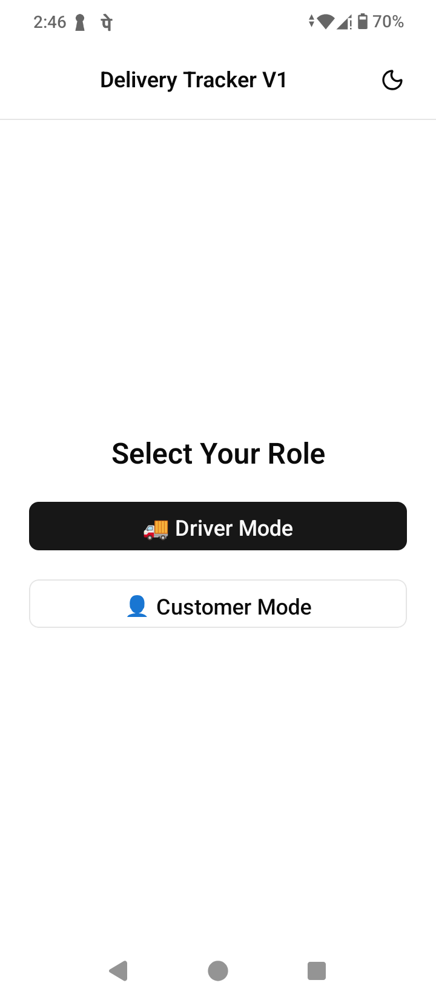
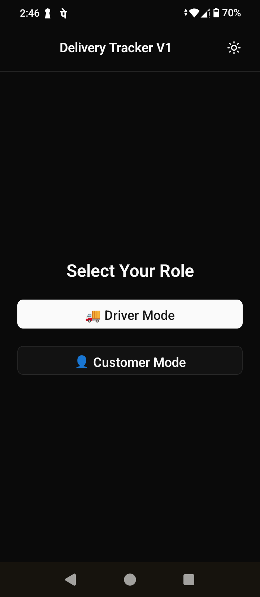
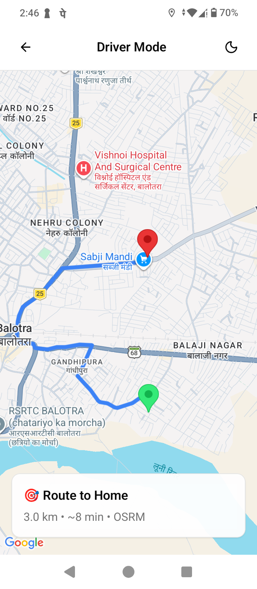
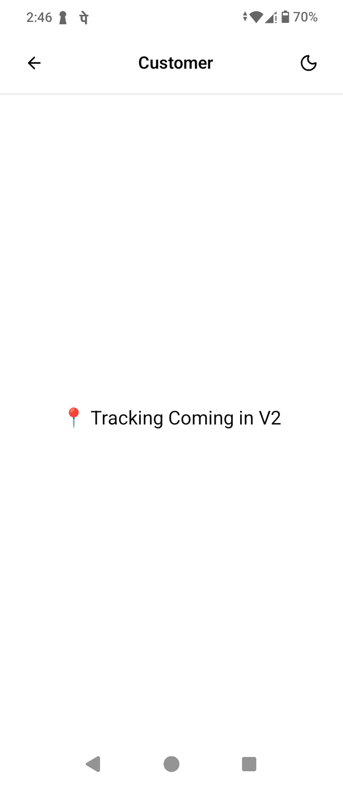

# Delivery Tracking App 🚚

> **⚠️ Proof of Concept (POC)** — This is a minimal demo to validate real-time GPS tracking + route visualization. Not production-ready. No backend. No auth. Just the core idea.

## 📸 Screenshots

<table>
  <tr>
    <td align="center">
      <strong>Home Screen</strong><br>
      <br>
      <em>Select Driver or Customer mode</em>
    </td>
    <td align="center">
      <strong>Home Screen (Dark)</strong><br>
      <br>
      <em>Dark mode toggle in navbar</em>
    </td>
    <td align="center">
      <strong>Driver Tracking</strong><br>
      <br>
      <em>Real-time GPS tracking with OSRM</em>
    </td>
    <td align="center">
      <strong>Customer View</strong><br>
      <br>
      <em>Live driver location (V2 placeholder)</em>
    </td>
  </tr>
</table>

## ✨ Features (What Works Now)

- 📍 **Real-time GPS Tracking** - Driver location updates automatically
- 🗺️ **Live Route Calculation** - Shows the best path using OSRM (free, no API key)
- 🎯 **Distance & ETA** - See how far and how long to destination
- 🔄 **Auto-updates** - Route recalculates when driver moves
- 📱 **Works on Android & iOS** - Built with Expo
- 🌐 **No Backend Needed** - Everything runs on the phone
- 🛡️ **No Billing Required** - Free routing, no credit card

## 🗓️ Future Ideas (Not Committed)

These are just ideas. Not planned. Not promised. Build only if the POC proves valuable.

- 👤 **Customer view:** See driver location on same map
- ⚡ **Redis + WebSocket:** Scale beyond 10 concurrent users
- 🗺️ **Mapbox/Google:** Premium routing + traffic (if revenue justifies cost)
- 🔐 **Simple auth:** Driver/customer login (if multi-user needed)

> 🎯 **Our Rule**: Build one feature at a time. Test on real device. Ship. Repeat.

## 🚀 Quick Start

### Prerequisites

- Node.js 18+
- pnpm (npm install -g pnpm)
- Expo Go app (on your phone)

### Installation

```bash
# 1. Clone
git clone https://github.com/sikandarmoyaldev/delivery-tracking-app.git
cd delivery-tracking-app

# 2. Install
pnpm install

# 3. Start
npx expo start

# 4. Open on phone
# Scan QR code with Expo Go app
```

## 📁 Project Structure

```bash
delivery-tracking-app/
├── src/
│   ├── app/
│   │   ├── _layout.tsx      # Root layout
│   │   ├── index.tsx        # Home screen (Driver/Customer buttons)
│   │   ├── driver.tsx       # Driver tracking with map
│   │   └── customer.tsx     # Customer view (placeholder)
│   ├── components/
│   │   ├── navbar.tsx       # Header with theme toggle
│   │   └── ui/              # Button, Text, etc.
│   └── lib/
│       └── store.ts         # App state
├── app.json                 # Expo config
└── package.json
```

## 🗺️ How It Works

- Driver opens app → Taps "Driver Mode"
- App requests GPS permission → Granted
- Map shows current location (green marker) + destination (red marker)
- Blue line draws route from driver to home using OSRM
- Driver moves → GPS updates → Route recalculates
- Distance & ETA update automatically

## 🛠️ Tech Stack

| Technology            | Purpose                                    |
| :-------------------- | :----------------------------------------- |
| **Expo SDK 54**       | Core React Native framework                |
| **react-native-maps** | Map display and visualization              |
| **expo-location**     | GPS tracking and location services         |
| **OSRM Public API**   | Free route calculation and navigation      |
| **NativeWind**        | Tailwind CSS styling for native components |
| **Zustand**           | Lightweight state management               |

## 📝 Configuration

Your Location (in `driver.tsx`)

```tsx
const HOME_COORDS = {
    latitude: 25.8356131, // Your destination latitude
    longitude: 72.2559479, // Your destination longitude
};
```

Replace with your actual coordinates.

## 🧪 Testing

- Open app on real device (simulator has no GPS)
- Grant location permission
- Wait for GPS signal (~5-10 seconds)
- See green marker (you) + red marker (destination)
- Walk/drive around → watch route update
